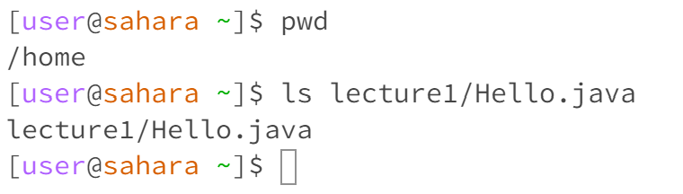

# Lab Report 1
## `cd` command examples

1.

We get this output because we used cd from the directory home/lecture1/messages. When using cd with no arguments, we navigate automatically to the root directory. This is not an error.

2.

We used cd with the argument as a directory. Because we were located at the home directory and cd into the directory lecture1/messages, we change directories on our next command. This is not an error.

3. 

Using cd to change into a file en-us.txt from the working directory lecture1/messages does not work. cd can only be used to change directories, not files. This is an error.

## `ls` command examples

1.

We get this output because we are currently located in home/lecture1/messages. So ls displays the files in the current working directory. This is not an error. 

2. 

We get this output because we gave ls an argument for which directory we should print the files for. This is not an error.

3. 

We get this output because we have already navigated to the lowest level possible in our directory using lecture1/Hello.java. ls simply prints the absolute path to the directory. This is not an error.

## `cat` command examples

1. 

We are located in the home directory and using cat with no command means that it will wait for an argument or some sort of keyboard input. We see empty lines as a result until I use CTRL+C to exit the command line. This is not an error.

2.

We are located in the home directory and want to show the contents of the argument we use. We cannot print the contents of directory so we are told that we are using cat on a directory. This is not an error.

3.

We are located in the home directory and we are using cat to display the contents of en-us.txt. The result is Hello World! which is contained in en-us.txt. This is not an error. 

